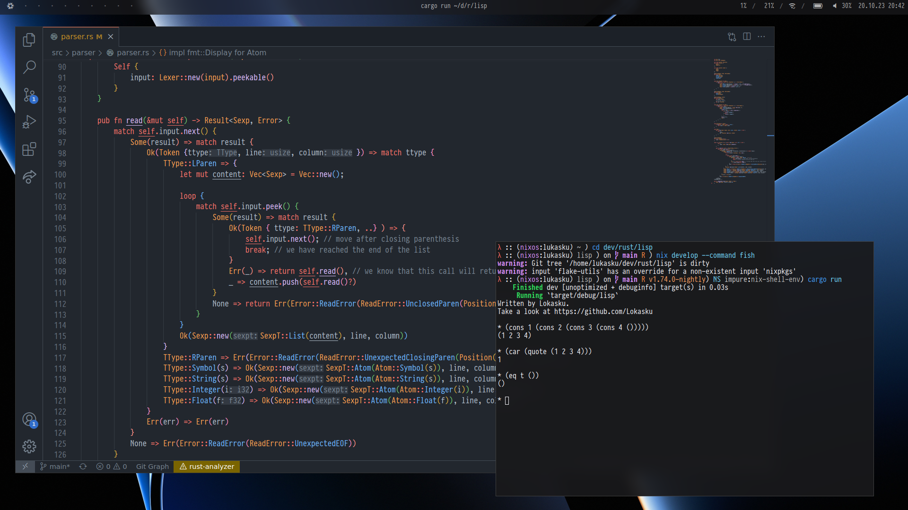
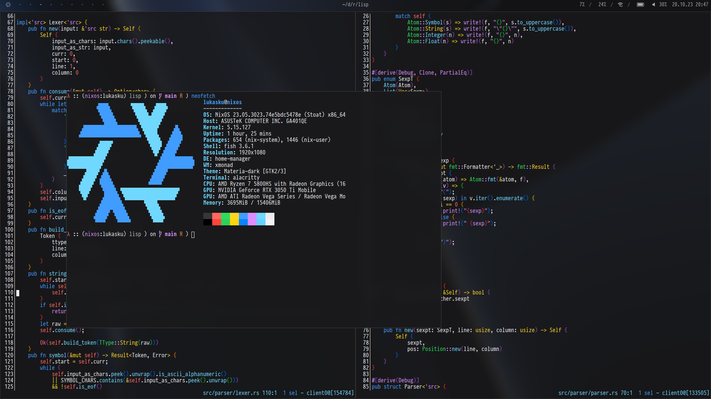

# Installation
First, add `home-manager` to `configuration.nix` if you haven't already (in `environment.systemPackages`).
Then, clone this repository in `~/.config` and rename it `nixpkgs`.
If you haven't already done so, add the latest stable version of the NixOS channel:
```
sudo nix-channel --add https://nixos.org/channels/nixos-23.05 nixos
```
as well as for `home-manager`:
```
nix-channel --add https://github.com/nix-community/home-manager/archive/release-23.05.tar.gz home-manager
```
Finally, update channels with `nix-channel --update`.
